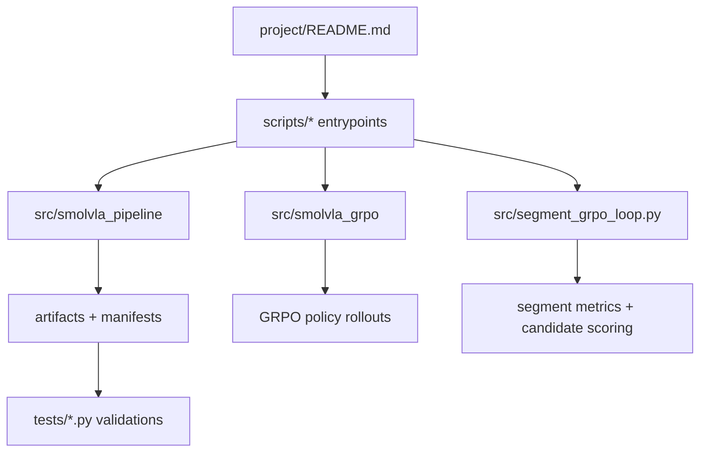

## Scope and repository target

Use this path as review scope: [/vol/bitbucket/aa6622/project](./vol/bitbucket/aa6622/project).

## Repo-level structure discovered

- Top-level folders: [.cursor](./vol/bitbucket/aa6622/project/.cursor), [docs](./vol/bitbucket/aa6622/project/docs), [mt10](./vol/bitbucket/aa6622/project/mt10), [scripts](./vol/bitbucket/aa6622/project/scripts), [src](./vol/bitbucket/aa6622/project/src), [tests](./vol/bitbucket/aa6622/project/tests), [vendor](./vol/bitbucket/aa6622/project/vendor).
- Root files with workflow relevance: [README.md](./vol/bitbucket/aa6622/project/README.md), [pytest.ini](./vol/bitbucket/aa6622/project/pytest.ini), [neurips.tex](./vol/bitbucket/aa6622/project/neurips.tex), [SMOLVLA_TOPK_FULL_RUN_PROGRESS.md](./vol/bitbucket/aa6622/project/SMOLVLA_TOPK_FULL_RUN_PROGRESS.md), pilot helper scripts.

## Main logic files to review first

- Primary evaluator/orchestrator path: [src/smolvla_pipeline/evaluator.py](./vol/bitbucket/aa6622/project/src/smolvla_pipeline/evaluator.py)
- Core MT50 campaign logic: [src/smolvla_pipeline/mt50_phase07_campaign.py](./vol/bitbucket/aa6622/project/src/smolvla_pipeline/mt50_phase07_campaign.py)
- GRPO rollout core: [src/smolvla_grpo/phase11_rollout.py](./vol/bitbucket/aa6622/project/src/smolvla_grpo/phase11_rollout.py)
- Segment GRPO driver and rollout loop: [src/segment_grpo_loop.py](./vol/bitbucket/aa6622/project/src/segment_grpo_loop.py)
- Meta-World policy/decode and determinism helpers: [src/metaworld_determinism.py](./vol/bitbucket/aa6622/project/src/metaworld_determinism.py), [src/metaworld_jepa_render.py](./vol/bitbucket/aa6622/project/src/metaworld_jepa_render.py)
- Scripted run entrypoints: [scripts/oracle/run_metaworld_oracle_eval.py](./vol/bitbucket/aa6622/project/scripts/oracle/run_metaworld_oracle_eval.py), [scripts/smolvla/run_metaworld_smolvla_eval.py](./vol/bitbucket/aa6622/project/scripts/smolvla/run_metaworld_smolvla_eval.py), [scripts/run_segment_grpo.py](./vol/bitbucket/aa6622/project/scripts/run_segment_grpo.py), [scripts/mt10/run_phase6_mt10.sh](./vol/bitbucket/aa6622/project/scripts/mt10/run_phase6_mt10.sh), [scripts/mt10/run_phase8_mt10.sh](./vol/bitbucket/aa6622/project/scripts/mt10/run_phase8_mt10.sh), [scripts/smolvla/launch_pushv3_smolvla_topk15.sh](./vol/bitbucket/aa6622/project/scripts/smolvla/launch_pushv3_smolvla_topk15.sh).

## High-confidence AI-generated / template-derived candidates

- Strong explicit marker: [scripts/mt10/run_phase6_mt10.sh](./vol/bitbucket/aa6622/project/scripts/mt10/run_phase6_mt10.sh) and [scripts/mt10/run_phase8_mt10.sh](./vol/bitbucket/aa6622/project/scripts/mt10/run_phase8_mt10.sh) use `(dry-run-placeholder)` as synthetic workflow output during dry-run mode.
- Strong explicit marker: [tests/mt10/test_pipeline_mt10_wrappers.py](./vol/bitbucket/aa6622/project/tests/mt10/test_pipeline_mt10_wrappers.py) asserts dry-run placeholders intentionally.
- Medium marker: [scripts/segment_grpo/run_all60_frame50_k3.py](./vol/bitbucket/aa6622/project/scripts/segment_grpo/run_all60_frame50_k3.py) has an "auto-generated" style run-name contract string in CLI help.
- Medium marker: [scripts/smolvla/launch_pushv3_smolvla_topk15.sh](./vol/bitbucket/aa6622/project/scripts/smolvla/launch_pushv3_smolvla_topk15.sh) includes campaign manifest templating and deterministic naming.
- Strong non-code placeholder markers: [neurips.tex](./vol/bitbucket/aa6622/project/neurips.tex) and [docs/superpowers/plans/*.md](./vol/bitbucket/aa6622/project/docs/superpowers/plans) contain `TODO`/`answerTODO` planning language.

## Notes on `src` and core Python health

- Scan for generation/edit disclaimers in `src` and runtime scripts did not find auto-generated banners like "generated by" in main code path.
- Most high-confidence template-like behavior in code is operationally valid dry-run or campaign manifest logic, not random duplicated machine-authored business logic.

## Proposed review flow

## Review-todo

- todo1: Do targeted manual pass over 5 strong-marker files above, verify each synthetic template is intentional and bounded.
- todo2: Confirm no unintentional AI-generated code in `src/*` by checking for external copy-paste patterns in adjacent functions (`evaluator`, `phase11_rollout`, `mt50_phase07_campaign`).
- todo3: If needed, add reviewer notes to [project/docs/superpowers/plans](./vol/bitbucket/aa6622/project/docs/superpowers/plans) and [neurips.tex](./vol/bitbucket/aa6622/project/neurips.tex) for cleanup of placeholder/plan prose.
- todo4: Provide exception list for generated artifacts that are expected behavior (dry-run placeholders, manifest fields, campaign IDs, run-name stamping) so future reviewers can distinguish intentional templates from accidental AI output.
