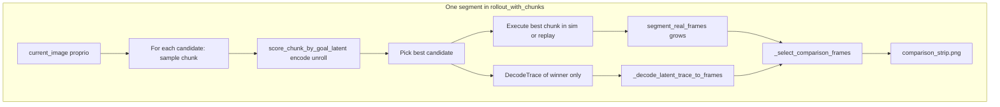

# WM Decode-Padding-Reset Pipeline Audit Plan

> **For agentic workers:** REQUIRED SUB-SKILL: Use superpowers:subagent-driven-development (recommended) or superpowers:executing-plans to implement this plan task-by-task. Steps use checkbox (`- [ ]`) syntax for tracking.

**Goal:** Determine whether decoded WM frames are incorrectly interpreted as one frame per **env** step when the checkpoint expects one latent step per **packed** WM action (e.g. Metaworld 20D = 5×4D). Find real bugs (padding vs execution, strip alignment, reset/goal mismatch) vs expected coarse temporal resolution.

**Architecture (one sentence):** [`run_segment_grpo.py`](../../../scripts/run_segment_grpo.py) loads SmolVLA + optional JEPA-WM, picks oracle start/goal PNGs, then [`rollout_with_chunks`](../../../src/segment_grpo_loop.py) loops segments—**score K candidate action chunks on the WM from the same start state**, execute the **winner** in sim/replay, optionally **decode** the winner’s latent trace and write **real vs pred** PNG strips.

**Tech Stack:** Python 3, NumPy, PyTorch, pytest, Metaworld (sim path), `torch.hub` JEPA-WM (`jepa_wm_metaworld`), LeRobot/SmolVLA (optional), imageio for PNG strips, PIL for resize in similarity/strip code.

**Repository root:** paths in this doc are relative to `project/` (parent of `src/`, `scripts/`, `tests/`).

---

## 0. Background for a reader with zero prior context

### 0.1 What problem the user is worried about

- The **simulator** advances one **4D** action per `env.step` (MetaWorld MT1).
- The **JEPA-WM Metaworld checkpoint** is trained so one `unroll` step consumes a **20D** action = **five** consecutive **normalized** 4D actions concatenated (training **frameskip** `f=5`). There is **no** per–env-step latent inside one WM step unless the model exposes it (typically it does not).
- So: **one decoded frame per WM unroll** ≈ **five env steps** of “motion budget,” not one. A **correct** visualization pairs pred column `k` with **real** frame at env index **`(k+1)*f`** (capped by `carried_steps`), not `k+1`.
- **Padding:** If env chunk length `T` is not a multiple of `f`, the code pads the last WM block by **repeating the last env action** to fill 5 slots. The WM then may predict **as if** 5 steps ran; the sim may have executed fewer before episode end—**semantic mismatch** to watch for (may look like “WM moved too much”).

### 0.2 Vocabulary

| Term | Meaning in this repo |
|------|----------------------|
| `env_action_dim` | Width of `env.step` vector (4 for MetaWorld). |
| `wm_dim` / `planner_action_dim` | WM `act_suffix` last dim (often 20 for Metaworld hub). |
| `factor` / `env_steps_per_wm_step` | `wm_dim // env_dim` when divisible; else 1 (see risk). Stored on `DecodeTrace.env_steps_per_wm_step`. |
| `act_suffix` | Tensor passed to `model.unroll(..., act_suffix=...)`, shape `(T_wm, B, wm_dim)` with `B=1` here. |
| `chunk_len` / `effective_len` | Number of **env** actions in the candidate chunk (CLI `--chunk-len`). |
| `carried_steps` | How many **env** steps actually executed for the **selected** chunk this segment. |
| Comparison strip | PNG: per column, **vertical** stack `concat([real, pred], axis=0)` — **sim render top**, **WM decode bottom**; stitched across segments. Optional `--comparison-strip-overlay` (default off): small box + text on **decode panel only** — L2 **d** to goal latent + **Δ** vs previous (pre-unroll initial for first column), plus `real_i`, `env_t`, `wm_dec k/N`, `f`, `cand`. |

### 0.3 Where “truth” is documented in-repo

- Plain language: [`WM-vs-env-chunk-len.md`](../WM-vs-env-chunk-len.md)

### 0.4 Core formulas (verify in code, do not assume)

- `T_wm = ceil(T / factor)` after padding inside `_pack_env_actions_for_wm`.
- Iterative mode: **`len(unroll calls) == T_wm`**, not `T` (see `test_wm_iterative_unroll_once_per_packed_wm_step`).
- Strip alignment when `factor > 1`: pred index `k` ↔ real frame index `min((k+1)*factor, carried_steps)` (see `test_select_comparison_frames_with_wm_step_factor`).

---

## 1. Exact per-segment control flow (critical: order of operations)

**Inside** `rollout_with_chunks` **one segment** does:

1. `segment_real_frames = [current_image]` (start of segment).
2. **For each candidate** `candidate_idx in range(num_candidates)`:
   - Build `chunk` via `_sample_smolvla_chunk` (real SmolVLA) or `_synthetic_chunk` (dry-run / no policy).
   - If WM + goal: `score_chunk_by_goal_latent(..., return_latent_trace=True)` → distance, `ScoreTrace`, `DecodeTrace` (per candidate). **Same** `(current_image, current_proprio)` for all candidates.
   - Store `candidate_traces[candidate_idx] = decode_trace`.
3. Select best candidate by score.
4. **Execute** `best_actions` for `effective_len` steps (or fewer if `done`): `_step_env` / replay index → append to `segment_real_frames`, set `carried_steps`, `executed_actions`.
5. If WM and `selected_trace`: `pred_frames = _decode_latent_trace_to_frames(wm_bundle, selected_trace)`.
6. If `comparison_root` and `pred_frames` and `carried_steps > 0`: `_write_comparison_segment_strip(..., env_steps_per_wm_step=selected_trace.env_steps_per_wm_step)` (only passed when `>1`).

**Implication for audits:** WM rollout uses **pre-execution** state; sim frames after execution are what the strip compares to. If start state ≠ oracle PNG, similarity warning fires but WM still encodes **live** sim state.

---

## 2. File map (what each file owns)

| Path | Role |
|------|------|
| `scripts/run_segment_grpo.py` | CLI: episodes, `--chunk-len`, `--wm-rollout-mode`, `--wm-scoring-latent`, `--carry-mode`, `--jepa-repo`, `--jepa-ckpt`, `--comparison-strip-overlay` / `--no-comparison-strip-overlay`, oracle paths, `comparison_root` under artifact dir, calls `rollout_with_chunks`. |
| `src/segment_grpo_loop.py` | **All** WM scoring, packing, unroll, decode, strip builders, sim/replay loop, `WMBundle`, dataclasses (`DecodeTrace`, `EpisodeLog`, `SegmentLog`). |
| `src/segment_grpo_reference.py` | Oracle run discovery, `load_oracle_reference_frames` (1-based goal index → `frame_XXXXXX.png`). |
| `vendor/pi05/jepa_cem_paired_pushv3_export.py` | `torch.hub` WM load (`_try_load_wm`), `_infer_action_dims`, SmolVLA load/exec (`_smolvla_exec_action`), image/proprio helpers used by `segment_grpo_loop` via dynamic import. |
| `tests/test_segment_grpo_loop.py` | Unit/integration tests for pack, unroll count, decode trace, comparison frames, rollout metadata. |
| `tests/test_run_segment_grpo_main.py` | CLI strict flags, manifest, rollout error paths. |
| `tests/test_segment_grpo_output_layout.py` | Output path nesting only. |

---

## 3. Key symbols and shapes (jump table for code reading)

| Symbol | Location (approx) | Contract |
|--------|-------------------|----------|
| `_infer_env_action_dim` | `segment_grpo_loop.py` | Prefers `preprocessor.action_mean.numel()`; else infer from chunk width vs `wm_dim`. |
| `_infer_model_action_dim` | `segment_grpo_loop.py` | Reads `model.model.action_dim`, action_encoder `in_features`, etc. |
| `_wm_action_block_factor` | `segment_grpo_loop.py` | `wm_dim // env_dim` if divisible, else **1** (risk: silent mismatch). |
| `_normalize_env_actions_for_wm` | `segment_grpo_loop.py` | `(T, env_dim)` → normalized; uses preprocessor mean/std on **device**. |
| `_pack_env_actions_for_wm` | `segment_grpo_loop.py` | Pads `T` to multiple of `factor`, reshape `(n_blk, wm_dim)`. |
| `score_chunk_by_goal_latent` | `segment_grpo_loop.py` | Full path from RGB/proprio → `encode` → packed `unroll` → distance to `goal_latent`; optional `DecodeTrace` with `env_steps_per_wm_step=factor`. |
| `_select_comparison_frames` | `segment_grpo_loop.py` | Strided real indices when `factor>1`. |
| `_decode_selected_trace` / `_decode_latent_trace_to_frames` | `segment_grpo_loop.py` | `decode_unroll` on visual tensor or fused dict. |
| `DecodeTrace` | `segment_grpo_loop.py` | `visual_latents`, `proprio_latents`, `env_steps_per_wm_step`. |
| `_to_wm_visual` | `segment_grpo_loop.py` | Resize to 256×256, float **0–255** (not 0–1) for hub `encode`. |

---

## 4. CLI flags that change WM behavior (audit matrix)

| Flag | Effect |
|------|--------|
| `--wm-rollout-mode iterative` (default) | One `unroll` per **packed** row `(1,1,wm_dim)`. |
| `--wm-rollout-mode batched` | Single `unroll` with full `act_suffix`; trace handling differs (dict vs tensor). |
| `--wm-scoring-latent visual/proprio/concat` | Which tensor drives distance and trace extraction; proprio-only avoids stuffing proprio into visual decode (see tests). |
| `--chunk-len` | Env steps per **candidate** chunk; drives `effective_len` and padding remainder `T % factor`. |
| `--carry-mode sim` vs `replay` | Real Metaworld vs indexed replay arrays; `env_action_dim` source differs. |
| `--strict-wm-scoring` / `--strict-decode` | Fail fast vs metadata fallback. |

---

## 5. Hypotheses to prove or disprove (user-visible “scaling bugs”)

- **H1 (often not a code bug):** Pred columns are **supposed** to be sparse vs env when `factor=5`; user expects 1:1 env frames. **Check:** strip uses `env_steps_per_wm_step`; document in artifact title or sidecar JSON.
- **H2 (real bug candidate):** `T % factor != 0` → WM roll includes **imaginary** padded steps; strip pairs preds to real using `carried_steps` cap—last pred may correspond to **fewer** executed steps than the WM “saw.” **Check:** segment where `carried_steps` is 3 with factor 5.
- **H3:** `wm_dim % env_dim != 0` → `factor==1` and `_pack_env_actions_for_wm` may **raise** or mis-pack; **Check:** integration with weird checkpoint.
- **H4:** Oracle `start_frame` mismatch (`reset_frame_warning`) → user thinks WM is wrong; WM encodes **current** sim. **Check:** `start_frame_similarity` in `EpisodeLog`.
- **H5:** Batched vs iterative produces different **decode trace lengths** vs `carried_steps`. **Check:** same `chunk_len`, both modes, count `pred_frames` and strip columns.

---

## Task 1: Build a complete file-level pipeline map

**Files:** §2 table.

- [ ] Document every tensor edge: `chunk (T, env_dim)` → normalized `(T, env_dim)` → packed `(T_wm, wm_dim)` → `actions_t (T_wm, 1, wm_dim)` → `unroll` → latents → `decode_unroll` → list of HWC uint8 frames.
- [ ] Document **parallel** path: executed `action_env` list (what sim did) vs WM input (normalized packed); they are derived from the **same** selected `best_actions` but WM path pads for packing.
- [ ] Fix mental model: scoring uses **pre-step** `(image, proprio)`; strip real frames include **post-step** captures after execution.

**Mermaid (correct ordering):**



---

## Task 2: Verify action scaling / frameskip math vs model contract

**Files:** `src/segment_grpo_loop.py`, `vendor/pi05/jepa_cem_paired_pushv3_export.py`, `tests/test_segment_grpo_loop.py`, `docs/superpowers/WM-vs-env-chunk-len.md`

- [ ] Trace `load_wm_bundle` → `planner_action_dim` and `_infer_model_action_dim` vs `preprocessor.action_mean`.
- [ ] Prove `T_wm = ceil(T/factor)` with tests (extend `test_normalize_and_pack_env_actions_for_wm_factor5`).
- [ ] **Decision point:** When `wm_dim % env_dim != 0`, is `factor=1` acceptable or should the code hard-fail? Add test for desired behavior.

**Existing tests to re-run:** `test_wm_iterative_unroll_once_per_packed_wm_step`, `test_score_chunk_normalizes_and_packs_before_unroll`, `test_normalize_and_pack_env_actions_for_wm_factor5`.

---

## Task 3: Audit padding for final partial WM blocks

**Files:** `src/segment_grpo_loop.py` (`_pack_env_actions_for_wm`), tests.

- [ ] Enumerate cases: `T ∈ {1..2*factor-1}` with `factor=5`, record packed rows and last-row padding pattern (`np.repeat(arr[-1:], n_pad, axis=0)`).
- [ ] Cross-link to **executed** length when episode ends early (`done` mid-chunk): `carried_steps` may be `< effective_len`.
- [ ] Add test: `carried_steps=3`, `factor=5`, `len(pred_frames)` from WM—strip must not claim alignment beyond `carried_steps` (today `ridx = min((k+1)*factor, cs)` caps this; verify no off-by-one vs `real_frames` indexing; `real_frames[0]` is **pre-execution** start).

---

## Task 4: Decode alignment audit (over-counting preds vs sim)

**Files:** `src/segment_grpo_loop.py`, `tests/test_segment_grpo_loop.py`

- [ ] Re-read `_select_comparison_frames` for `factor>1` vs `factor==1` branches; `factor==1` pairs `real_frames[:limit]` with `pred_frames[:limit]` where `limit` ties to `carried_steps` — confirm index 0 uses **start** frame vs **after first step** (document intended semantics).
- [ ] `test_select_comparison_frames_with_wm_step_factor` and `test_select_comparison_frames_keeps_t0_as_context` are the golden references.
- [ ] Batched mode: `decode_trace_steps` length vs iterative; ensure strip does not assume `len(pred)==carried_steps` when `factor>1`.

---

## Task 5: Reset / start-frame / seed audit

**Files:** `segment_grpo_loop.py`, `segment_grpo_reference.py`, `run_segment_grpo.py`

- [ ] `load_oracle_reference_frames`: `goal_frame_index` is **1-based** (`25` → `frame_000024.png`); `start_frame_index` default 0 → `frame_000000.png`.
- [ ] `_reset_env(env, seed)` vs CLI `--reset-seed` / top-15 table seeds.
- [ ] `_frame_similarity(current_image, start_frame)` only sets warning; does not change state.
- [ ] Goal latent from `goal_frame` uses `fallback_proprio=current_proprio` when encoding oracle image—**goal is not oracle proprio**; note for “goal looks wrong” reports.

---

## Task 6: Metadata and artifact trail

**Files:** `segment_grpo_loop.py`, `run_segment_grpo.py`, tests.

- [ ] Candidate meta already includes `wm_env_steps_per_wm_step`, `effective_chunk_len`, `env_action_dim`, decode status; verify JSON episode logs from a real run.
- [ ] Artifact paths: per-segment PNGs flat under `comparison/episode_XXXX/` with names like `comparison_strip_steps_SSSS_to_EEEE_segSSSS_candCCC.png` (optional `wmfNN_` prefix when WM stride is greater than 1); stitched `episode_XXXX_comparison_strip.png`.
- [ ] Optional improvement: single startup log line `wm_dim`, `env_dim`, `factor` when bundle loads.

---

## Task 7: Upstream JEPA-WM contract

**Files:** `vendor/pi05/jepa_cem_paired_pushv3_export.py`, hub cache `facebookresearch_jepa-wms` (if present under `~/.cache/torch/hub/`)

- [ ] Upstream eval reshapes planner actions `(t, f*d) → (t*f, d)` before env multi-step; align narrative with local pack/unpack.
- [ ] Read `plan_evaluator.py` / YAML `frameskip`, `action_skip` as reference; this repo infers `f` from dims, not from YAML.

---

## 8. Commands (copy-paste)

From repository root (directory containing `src/`, `scripts/`, `tests/`):

```bash
# Focused WM/pack/strip tests
pytest tests/test_segment_grpo_loop.py -v --tb=short

# CLI / strict flags
pytest tests/test_run_segment_grpo_main.py -v --tb=short

# Full segment tests (may skip torch in minimal env)
pytest tests/ -k segment_grpo -v --tb=short
```

Dry-run smoke:

```bash
python scripts/run_segment_grpo.py --dry-run --output-json /tmp/out.json --episodes 1
```

---

## 9. Deliverable: bug report format

Each finding:

1. **Symptom** (what looks wrong in PNG or metrics)
2. **File:function** and line range
3. **Root cause** (wrong index, padding semantics, or expected WM coarseness)
4. **Impact** (scoring skew vs visualization only)
5. **Repro** (test name or minimal script)

---

## 10. Is this plan enough alone? (honest scope)

**Enough for:** Reading the right files, tracing tensors, writing/running pytest fakes, and deciding H1–H5 with **code evidence**.

**Not enough without additions below:** Installing deps, knowing where PNGs/JSON land, reproducing a **full** hub WM run, or judging **visual** strip quality (needs human eye or a separate image-diff harness).

**Companion docs (not duplicated here):** Upstream/paper proof that Metaworld WM uses `f=5` lives in the separate semantics write-up; read [`WM-vs-env-chunk-len.md`](../WM-vs-env-chunk-len.md) and, if available, Cursor plan `wm_action_semantics_78036ffe` for jepa-wms citations.

---

## 11. Prerequisites for a zero-context executor

**Working directory:** Shell `cd` to the repo folder that **contains** `src/`, `scripts/`, and `tests/` (in this workspace that is often `/vol/bitbucket/aa6622/project`; if your clone differs, substitute your path—all relative paths in this plan assume that directory as root).

**Python:** 3.10+ typical; use the project venv if one exists (`python -m venv`, then `pip install` per project `requirements.txt` / `pyproject.toml` if present—**read those files** in the clone; do not assume a global torch).

**Tests:** `pytest` must be installed. Some tests `importorskip("torch")` or `tensordict`; without them, run only the subsets that skip cleanly.

**JEPA helper dependency:** [`src/segment_grpo_loop.py`](../../../src/segment_grpo_loop.py) dynamically loads [`vendor/pi05/jepa_cem_paired_pushv3_export.py`](../../../vendor/pi05/jepa_cem_paired_pushv3_export.py). If that file is missing, WM/SmolVLA paths fail at runtime.

**Full WM load:** `load_wm_bundle` uses `torch.hub.load(..., "jepa_wm_metaworld", ...)`. You need a valid `--jepa-repo` (local checkout of the hub repo **or** GitHub identifier string hub accepts) and checkpoint resolution via `JEPAWM_CKPT` / `_resolve_ckpt` in the vendor helper. Offline/air-gapped: point `--jepa-repo` at a **local directory** and ensure the checkpoint file path is valid.

**Segment GRPO without WM:** `--dry-run` or omitting `--jepa-repo` (when `required=False`) skips real WM; audit Tasks 2–7 then require **fake models in tests**, not hub.

---

## 12. Artifacts and JSON (where to look after a run)

From [`run_segment_grpo.py`](../../../scripts/run_segment_grpo.py) (approx. L314–316):

- Episode JSON path: `episode_output` from `_resolve_output_path(...)`.
- `artifact_dir = episode_output.parent / f"{episode_output.stem}_artifacts"`.
- **`comparison_root = artifact_dir / "comparison"`** — per-segment strips are flat files under `comparison/episode_XXXX/` (descriptive basenames from `_comparison_strip_basename`); stitched episode strip: `comparison/episode_XXXX_comparison_strip.png` (see `rollout_with_chunks` + `_stitch_comparison_strip`).

**Executor checklist:** Open the emitted `EpisodeLog` JSON; inspect `metadata`, per-`segments[].metadata`, and `segments[].candidates[].meta` for `wm_env_steps_per_wm_step`, `decode_status`, `carried_steps` (on `SegmentLog`), and failure strings.

---

## 13. `segment_real_frames` index convention (easy to get wrong)

After each env step in a segment, a new frame is **appended**. So for a segment that executes `carried_steps == N`:

- `real_frames[0]` = **observation at segment start** (before any of the `N` actions).
- `real_frames[i]` for `1 <= i <= N` = observation **after** the `i`-th executed action.

When **`factor == 1`**, `_select_comparison_frames` pairs `pred_frames[k]` with `real_frames[k]` for `k < min(carried_steps, len(pred))` (see implementation: `limit` ties to `carried_steps` and `len(real_frames)-1`). So **column 0** compares pred at first WM step to **start** frame, not post-first-action—**intentional** in current code; document when filing bugs.

When **`factor > 1`**, pred column `k` maps to `real_frames[ridx]` with `ridx = min((k+1)*factor, carried_steps)` (and `ridx < len(real_frames)`); see `test_select_comparison_frames_with_wm_step_factor`.

---

## 14. Example commands (beyond dry-run)

**Minimal audit (no hub, no Metaworld):**

```bash
cd /path/to/project   # directory containing scripts/
pytest tests/test_segment_grpo_loop.py -v --tb=short
```

**Full pipeline (illustrative—adjust paths):**

```bash
cd /path/to/project
python scripts/run_segment_grpo.py \
  --checkpoint "<smolvla_checkpoint_hf_or_local>" \
  --jepa-repo "<local_jepa_wms_repo_or_hub_ref>" \
  --jepa-ckpt jepa_wm_metaworld.pth.tar \
  --output-json artifacts/phase08_segment_grpo_baseline/segment_grpo_run.json \
  --chunk-len 8 \
  --wm-rollout-mode iterative
```

Strips appear only when WM loads, `comparison_root` is set (automatic when using default artifact layout), decode succeeds, and `carried_steps > 0`.

---

## 15. Definition of “audit complete”

- [ ] H1–H5 each marked **confirmed bug / not a bug / inconclusive** with pointer to code or test name.
- [ ] Any confirmed bug matches the report template in §9.
- [ ] `pytest tests/test_segment_grpo_loop.py` and `pytest tests/test_run_segment_grpo_main.py` pass after any new tests; no regressions.
- [ ] Optional: short `docs/superpowers/reports/YYYY-MM-DD-wm-audit-findings.md` (or issue comment) summarizing outcomes—create only if the team wants a written record.

---

## Execution recommendation

- [ ] **Lane A:** Static proof + extend `test_segment_grpo_loop.py` for edge cases in §5.
- [ ] **Lane B:** Fake `encode`/`unroll`/`decode_unroll` models (pattern already in tests) to simulate `factor=5` without hub.
- [ ] Final: ranked list H1–H5 resolved with evidence.

**Two execution options for implementers:**

1. **Subagent-driven** — one subagent per task, review between tasks.
2. **Inline** — single session, checkpoints after Tasks 2–4.

Which approach?
