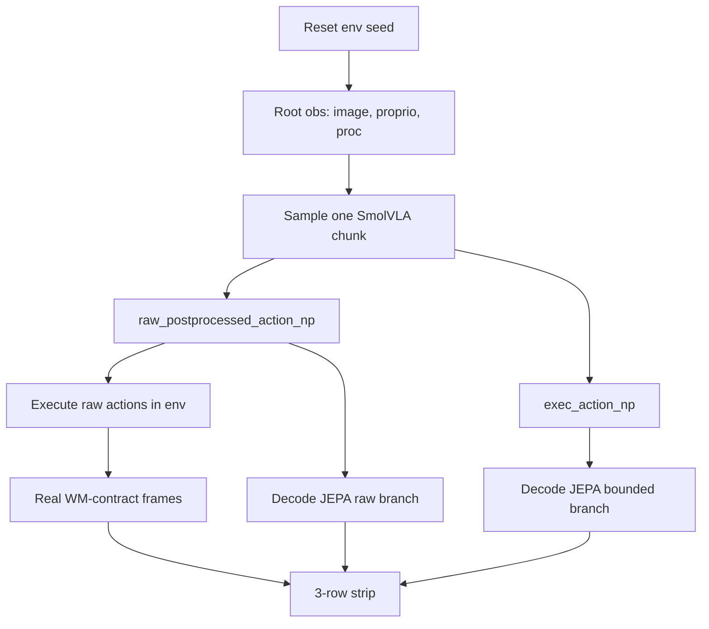

# Phase12 Raw Vs Bounded Decode Compare Implementation Plan

> **For agentic workers:** REQUIRED SUB-SKILL: Use superpowers:subagent-driven-development (recommended) or superpowers:executing-plans to implement this plan task-by-task. Steps use checkbox (`- [ ]`) syntax for tracking.

**Goal:** Build a 6-episode Phase12 diagnostic smoke that uses one sampled SmolVLA chunk per segment, executes raw actions in the real env, and compares JEPA decodes from the same root/action chunk under raw vs clipped WM actions.

**Architecture:** Keep this separate from GRPO training: no optimizer, no group rewards, no candidate selection. Extract reusable WM decode/artifact helpers into `src/smolvla_grpo/` so the new script does not depend on private trainer internals. The script writes video, per-segment actions, and a 3-row strip: real env frames, raw-action WM decode, bounded-action WM decode.

**Tech Stack:** Python, NumPy, PyTorch, imageio/PIL, existing Phase12 LeRobot adapter, JEPA-WM helpers, PBS/CX3.

---

## Execution Mode Recommendation

- Use inline execution for this plan.
- Reason: small file count but tight contracts across action clipping, WM decode, env stepping, frame alignment, and PBS env vars. Keeping these decisions in one thread reduces drift.
- Do not split implementation across fresh builder subagents by default.
- After Task 5 or Task 6, run `code-reviewer` over the diff before queueing PBS.

## Critical Corrections To Old Plan

- Do not run two separate profiles. That re-samples and executes different actions. Instead sample once, execute once, decode twice.
- Do not implement via GRPO train loop. `group_size=1` gives zero advantages and training semantics add noise. Use diagnostic loop only.
- Do not import `_Phase12SelectedRolloutEnv` / `_decode_phase12_prediction_frames` from `scripts/grpo/train_phase12_wm_chunk_grpo.py` in new script. Move public reusable helpers into `src/smolvla_grpo/phase12_decode_compare.py` or `src/smolvla_grpo/phase12_wm_decode.py`.
- Do not default `JEPA_WM_DISABLE_IMAGE_HEAD=1` for this PBS job. Decode needs image head. Use `JEPA_WM_DISABLE_IMAGE_HEAD="${JEPA_WM_DISABLE_IMAGE_HEAD:-0}"`.
- Do not make `parse_args([])` fail by setting `required=True` on paths in tests. Use defaults matching current smoke; PBS overrides to RDS paths.
- Do save exact actions. Existing smoke only saves aggregate action telemetry.

## Runtime Contract

- Episodes: `6`, seeds `2000..2005`.
- Task: `push-v3`.
- Chunk length: `50` env actions = `10` WM unroll steps at pack factor `5`.
- Candidate count: exactly `1`.
- Env action: raw postprocessed SmolVLA action (`raw_postprocessed_action_np`), per user request. MetaWorld may clip internally.
- Raw WM decode: same raw action chunk.
- Bounded WM decode: same action chunk clipped to env bounds.
- Segment cadence: one VLA sample, execute chunk open-loop, then next root obs/image.



## File Map

- Create: `src/smolvla_grpo/phase12_decode_compare.py`
  - Public reusable helpers: action variants, selected rollout env, WM decode, row alignment, strip writer, action `.npz` writer, manifest builders.
- Create: `scripts/grpo/compare_phase12_raw_vs_bounded_decode.py`
  - CLI/resource loading/orchestration only.
- Create: `scripts/grpo/submit_phase12_raw_vs_bounded_decode_6ep.pbs`
  - PBS wrapper with decode image head enabled.
- Create: `tests/test_phase12_decode_compare.py`
  - Unit tests for pure helpers and manifest/action dump contracts.
- Modify: `tests/test_phase12_pbs_static.py`
  - Static contract for PBS script.
- Optional modify: `scripts/grpo/train_phase12_wm_chunk_grpo.py`
  - Only if extracting duplicate `_decode_phase12_prediction_frames` to public helper; keep behavior identical.

---

## Task 1: Extract Public Compare Helpers

**Files:**
- Create: `src/smolvla_grpo/phase12_decode_compare.py`
- Test: `tests/test_phase12_decode_compare.py`

- [ ] **Step 1: Write failing action variant test**

```python
import numpy as np
import pytest


def test_build_action_variants_executes_raw_and_decodes_raw_vs_clipped() -> None:
    from smolvla_grpo.phase12_decode_compare import build_action_variants

    raw = np.array([[2.0, -2.0, 0.25, 1.5]], dtype=np.float32)
    variants = build_action_variants(
        raw_actions=raw,
        clipped_actions=None,
        action_low=np.full((4,), -1.0, dtype=np.float32),
        action_high=np.full((4,), 1.0, dtype=np.float32),
    )

    np.testing.assert_allclose(variants.env_actions, raw)
    np.testing.assert_allclose(variants.raw_wm_actions, raw)
    np.testing.assert_allclose(variants.bounded_wm_actions, [[1.0, -1.0, 0.25, 1.0]])
    assert variants.metadata["env_action_source"] == "raw_postprocessed"
    assert variants.metadata["raw_action_max_abs"] == pytest.approx(2.0)
    assert variants.metadata["bounded_action_max_abs"] == pytest.approx(1.0)
    assert variants.metadata["clip_delta_max_abs"] == pytest.approx(1.0)
```

- [ ] **Step 2: Run failing test**

Run:

```bash
module load tools/prod Python/3.12.3-GCCcore-13.3.0 && PYTHONPATH=".:src" /rds/general/user/aa6622/home/.envs/lerobot_mw_py312/bin/pytest tests/test_phase12_decode_compare.py::test_build_action_variants_executes_raw_and_decodes_raw_vs_clipped -q
```

Expected: FAIL with `ModuleNotFoundError` or missing `build_action_variants`.

- [ ] **Step 3: Implement action variants**

Add:

```python
from __future__ import annotations

from dataclasses import dataclass
from pathlib import Path
from typing import Any

import numpy as np


@dataclass(frozen=True)
class ActionVariants:
    env_actions: np.ndarray
    raw_wm_actions: np.ndarray
    bounded_wm_actions: np.ndarray
    metadata: dict[str, Any]


def build_action_variants(
    *,
    raw_actions: np.ndarray,
    clipped_actions: np.ndarray | None,
    action_low: np.ndarray,
    action_high: np.ndarray,
) -> ActionVariants:
    raw = np.asarray(raw_actions, dtype=np.float32)
    if raw.ndim != 2:
        raise ValueError(f"raw_actions must be 2-D, got {raw.shape}")
    low = np.asarray(action_low, dtype=np.float32).reshape(1, -1)
    high = np.asarray(action_high, dtype=np.float32).reshape(1, -1)
    if clipped_actions is None:
        bounded = np.clip(raw, low, high).astype(np.float32, copy=False)
    else:
        bounded = np.asarray(clipped_actions, dtype=np.float32)
    if bounded.shape != raw.shape:
        raise ValueError(f"bounded actions shape {bounded.shape} != raw shape {raw.shape}")
    delta = raw - bounded
    changed = raw != bounded
    return ActionVariants(
        env_actions=raw,
        raw_wm_actions=raw,
        bounded_wm_actions=bounded,
        metadata={
            "env_action_source": "raw_postprocessed",
            "raw_wm_action_source": "raw_postprocessed",
            "bounded_wm_action_source": "clipped",
            "raw_action_max_abs": float(np.max(np.abs(raw))) if raw.size else 0.0,
            "bounded_action_max_abs": float(np.max(np.abs(bounded))) if bounded.size else 0.0,
            "clip_delta_max_abs": float(np.max(np.abs(delta))) if delta.size else 0.0,
            "clip_fraction": float(np.mean(changed)) if raw.size else 0.0,
            "clip_any": bool(np.any(changed)),
        },
    )
```

- [ ] **Step 4: Run passing test**

Run same test. Expected: PASS.

- [ ] **Step 5: Commit**

```bash
git add src/smolvla_grpo/phase12_decode_compare.py tests/test_phase12_decode_compare.py
git commit -m "feat(phase12): add decode compare actions"
```

## Task 2: Add 3-Row Strip + Action Dump Helpers

**Files:**
- Modify: `src/smolvla_grpo/phase12_decode_compare.py`
- Test: `tests/test_phase12_decode_compare.py`

- [ ] **Step 1: Write failing strip/action tests**

```python
def test_three_row_strip_aligns_real_to_wm_steps(tmp_path: Path) -> None:
    from smolvla_grpo.phase12_decode_compare import align_decode_rows, write_three_row_decode_strip

    real = [np.full((2, 2, 3), i, dtype=np.uint8) for i in range(12)]
    raw = [np.full((2, 2, 3), 100 + i, dtype=np.uint8) for i in range(2)]
    bounded = [np.full((2, 2, 3), 200 + i, dtype=np.uint8) for i in range(2)]

    rows, indices = align_decode_rows(
        real_frames=real,
        raw_pred_frames=raw,
        bounded_pred_frames=bounded,
        env_steps_per_wm_step=5,
        carried_steps=10,
    )

    assert indices == [5, 10]
    assert [int(frame[0, 0, 0]) for frame in rows[0]] == [5, 10]
    assert [int(frame[0, 0, 0]) for frame in rows[1]] == [100, 101]
    assert [int(frame[0, 0, 0]) for frame in rows[2]] == [200, 201]

    out = write_three_row_decode_strip(
        tmp_path / "real_raw_bounded_decode_strip.png",
        real_frames=real,
        raw_pred_frames=raw,
        bounded_pred_frames=bounded,
        env_steps_per_wm_step=5,
        carried_steps=10,
    )
    assert out.exists()


def test_write_actions_npz_contains_raw_bounded_env(tmp_path: Path) -> None:
    from smolvla_grpo.phase12_decode_compare import write_actions_npz

    path = write_actions_npz(
        tmp_path / "actions_raw_bounded_env.npz",
        raw_actions=np.array([[2.0, -2.0, 0.0, 1.5]], dtype=np.float32),
        bounded_actions=np.array([[1.0, -1.0, 0.0, 1.0]], dtype=np.float32),
        env_actions=np.array([[2.0, -2.0, 0.0, 1.5]], dtype=np.float32),
    )

    data = np.load(path)
    np.testing.assert_allclose(data["raw_actions"], [[2.0, -2.0, 0.0, 1.5]])
    np.testing.assert_allclose(data["bounded_actions"], [[1.0, -1.0, 0.0, 1.0]])
    np.testing.assert_allclose(data["env_actions"], [[2.0, -2.0, 0.0, 1.5]])
    np.testing.assert_allclose(data["clip_delta"], [[1.0, -1.0, 0.0, 0.5]])
```

- [ ] **Step 2: Run failing tests**

Run:

```bash
module load tools/prod Python/3.12.3-GCCcore-13.3.0 && PYTHONPATH=".:src" /rds/general/user/aa6622/home/.envs/lerobot_mw_py312/bin/pytest tests/test_phase12_decode_compare.py -q
```

Expected: FAIL missing helpers.

- [ ] **Step 3: Implement helpers**

Add:

```python
def _to_rgb_uint8(frame: np.ndarray) -> np.ndarray:
    arr = np.asarray(frame)
    if arr.ndim != 3 or arr.shape[-1] not in (3, 4):
        raise ValueError(f"frame must be HxWx3/4, got {arr.shape}")
    if arr.shape[-1] == 4:
        arr = arr[..., :3]
    if arr.dtype != np.uint8:
        if np.issubdtype(arr.dtype, np.floating) and float(np.max(arr)) <= 1.5:
            arr = (np.clip(arr, 0.0, 1.0) * 255.0).astype(np.uint8)
        else:
            arr = np.clip(arr, 0, 255).astype(np.uint8)
    return np.ascontiguousarray(arr)


def _resize_like(frame: np.ndarray, target: np.ndarray) -> np.ndarray:
    f = _to_rgb_uint8(frame)
    t = _to_rgb_uint8(target)
    if f.shape[:2] == t.shape[:2]:
        return f
    from PIL import Image

    return np.asarray(Image.fromarray(f).resize((t.shape[1], t.shape[0])))


def align_decode_rows(
    *,
    real_frames: list[np.ndarray],
    raw_pred_frames: list[np.ndarray],
    bounded_pred_frames: list[np.ndarray],
    env_steps_per_wm_step: int,
    carried_steps: int,
) -> tuple[list[list[np.ndarray]], list[int]]:
    factor = max(1, int(env_steps_per_wm_step))
    carry = max(0, int(carried_steps))
    count = min(len(raw_pred_frames), len(bounded_pred_frames))
    rows: list[list[np.ndarray]] = [[], [], []]
    indices: list[int] = []
    for k in range(count):
        ridx = min((k + 1) * factor, carry)
        if ridx >= len(real_frames):
            break
        real_rgb = _to_rgb_uint8(real_frames[ridx])
        rows[0].append(real_rgb)
        rows[1].append(_resize_like(raw_pred_frames[k], real_rgb))
        rows[2].append(_resize_like(bounded_pred_frames[k], real_rgb))
        indices.append(int(ridx))
    if not rows[0]:
        raise ValueError("no aligned decode frames")
    return rows, indices


def write_three_row_decode_strip(
    path: Path,
    *,
    real_frames: list[np.ndarray],
    raw_pred_frames: list[np.ndarray],
    bounded_pred_frames: list[np.ndarray],
    env_steps_per_wm_step: int,
    carried_steps: int,
) -> Path:
    import imageio.v2 as imageio

    rows, _indices = align_decode_rows(
        real_frames=real_frames,
        raw_pred_frames=raw_pred_frames,
        bounded_pred_frames=bounded_pred_frames,
        env_steps_per_wm_step=env_steps_per_wm_step,
        carried_steps=carried_steps,
    )
    row_images = [np.concatenate(row, axis=1) for row in rows]
    strip = np.concatenate(row_images, axis=0)
    path = Path(path)
    path.parent.mkdir(parents=True, exist_ok=True)
    imageio.imwrite(path, strip)
    return path


def write_actions_npz(
    path: Path,
    *,
    raw_actions: np.ndarray,
    bounded_actions: np.ndarray,
    env_actions: np.ndarray,
) -> Path:
    raw = np.asarray(raw_actions, dtype=np.float32)
    bounded = np.asarray(bounded_actions, dtype=np.float32)
    env = np.asarray(env_actions, dtype=np.float32)
    path = Path(path)
    path.parent.mkdir(parents=True, exist_ok=True)
    np.savez_compressed(
        path,
        raw_actions=raw,
        bounded_actions=bounded,
        env_actions=env,
        clip_delta=raw - bounded,
    )
    return path
```

- [ ] **Step 4: Run passing tests**

Run same test file. Expected: PASS.

- [ ] **Step 5: Commit**

```bash
git add src/smolvla_grpo/phase12_decode_compare.py tests/test_phase12_decode_compare.py
git commit -m "feat(phase12): write raw bounded decode strips"
```

## Task 3: Move WM Decode Into Public Helper

**Files:**
- Modify: `src/smolvla_grpo/phase12_decode_compare.py`
- Modify: `scripts/grpo/train_phase12_wm_chunk_grpo.py`
- Test: `tests/test_phase12_decode_compare.py`

- [ ] **Step 1: Write static guard test**

```python
def test_train_script_uses_public_phase12_decoder() -> None:
    text = Path("scripts/grpo/train_phase12_wm_chunk_grpo.py").read_text(encoding="utf-8")
    assert "from smolvla_grpo.phase12_decode_compare import decode_phase12_prediction_frames" in text
    assert "_decode_phase12_prediction_frames" not in text
```

- [ ] **Step 2: Run failing test**

Expected: FAIL because decoder is still private in trainer.

- [ ] **Step 3: Extract decoder**

Move body of `scripts/grpo/train_phase12_wm_chunk_grpo.py::_decode_phase12_prediction_frames` into:

```python
def decode_phase12_prediction_frames(
    wm_bundle: Any,
    *,
    image: Any,
    proprio: Any,
    actions: Any,
    mode: str,
) -> list[Any]:
    ...
```

Keep same imports from `segment_grpo_loop`: `DecodeTrace`, `_decode_latent_trace_to_frames`, `_infer_env_action_dim`, `_infer_model_action_dim`, `_next_latent_state_after_unroll`, `_normalize_env_actions_for_wm`, `_pack_env_actions_for_wm`, `_to_wm_proprio`, `_to_wm_visual`, `_wm_action_block_factor`.

In trainer, replace calls with public helper:

```python
from smolvla_grpo.phase12_decode_compare import decode_phase12_prediction_frames
```

and:

```python
decode_fn=lambda: decode_phase12_prediction_frames(...)
```

- [ ] **Step 4: Run focused tests**

```bash
module load tools/prod Python/3.12.3-GCCcore-13.3.0 && PYTHONPATH=".:src" /rds/general/user/aa6622/home/.envs/lerobot_mw_py312/bin/pytest tests/test_phase12_decode_compare.py tests/test_phase12_training_loop.py -q
```

Expected: PASS.

- [ ] **Step 5: Commit**

```bash
git add src/smolvla_grpo/phase12_decode_compare.py scripts/grpo/train_phase12_wm_chunk_grpo.py tests/test_phase12_decode_compare.py
git commit -m "refactor(phase12): expose wm decode helper"
```

## Task 4: Create Diagnostic CLI

**Files:**
- Create: `scripts/grpo/compare_phase12_raw_vs_bounded_decode.py`
- Test: `tests/test_phase12_decode_compare.py`

- [ ] **Step 1: Write parser/defaults test**

```python
def test_compare_decode_parse_defaults() -> None:
    from scripts.grpo.compare_phase12_raw_vs_bounded_decode import parse_args

    args = parse_args([])

    assert args.num_episodes == 6
    assert args.chunk_len == 50
    assert args.train_seed_base == 2000
    assert args.task == "push-v3"
    assert args.goal_latent_mode == "visual_proprio"
    assert str(args.output_dir).endswith("artifacts/phase12_raw_vs_bounded_decode/dry_run")
```

- [ ] **Step 2: Run failing test**

Expected: FAIL missing script/parser.

- [ ] **Step 3: Implement CLI**

Script imports public helpers plus existing loaders:

```python
from scripts.grpo.train_phase12_wm_chunk_grpo import (
    _sample_old_action_chunk,
    build_old_wrapper,
    load_phase12_train_resources,
)
from smolvla_grpo.lerobot_metaworld_adapter import OfficialLeRobotMetaWorldGRPORollout, resolve_lerobot_horizon
from smolvla_grpo.phase12_decode_compare import (
    build_action_variants,
    decode_phase12_prediction_frames,
    write_actions_npz,
    write_three_row_decode_strip,
)
from smolvla_grpo.phase12_diagnostics import write_phase12_episode_video
from smolvla_grpo.phase12_pixels import policy_rgb_from_obs, wm_rgb_from_policy_rgb_corner2
```

Parser:

```python
def parse_args(argv: list[str] | None = None) -> argparse.Namespace:
    p = argparse.ArgumentParser(description=__doc__)
    p.add_argument("--checkpoint", type=str, default="jadechoghari/smolvla_metaworld")
    p.add_argument("--jepa-ckpt", type=str, default="jepa_wm_metaworld.pth.tar")
    p.add_argument("--jepa-repo", type=str, default="")
    p.add_argument("--output-dir", type=Path, default=Path("artifacts/phase12_raw_vs_bounded_decode/dry_run"))
    p.add_argument("--task", type=str, default="push-v3")
    p.add_argument("--num-episodes", type=int, default=6)
    p.add_argument("--chunk-len", type=int, default=50)
    p.add_argument("--max-steps", type=int, default=120)
    p.add_argument("--train-seed-base", type=int, default=2000)
    p.add_argument("--goal-latent-mode", choices=("visual_proprio", "visual_only_ablation"), default="visual_proprio")
    p.add_argument("--action-transform", choices=("no_tanh", "tanh_norm_ablation"), default="no_tanh")
    p.add_argument("--old-policy-inference-mode", action=argparse.BooleanOptionalAction, default=True)
    p.add_argument("--strict-decode", action="store_true", default=True)
    p.add_argument("--dry-run", action="store_true")
    return p.parse_args(argv)
```

- [ ] **Step 4: Run parser test**

Run focused test. Expected: PASS.

- [ ] **Step 5: Commit**

```bash
git add scripts/grpo/compare_phase12_raw_vs_bounded_decode.py tests/test_phase12_decode_compare.py
git commit -m "feat(phase12): add decode compare cli"
```

## Task 5: Implement Episode Loop + Manifests

**Files:**
- Modify: `scripts/grpo/compare_phase12_raw_vs_bounded_decode.py`
- Test: `tests/test_phase12_decode_compare.py`

- [ ] **Step 1: Write manifest tests**

```python
def test_build_summary_records_episode_outputs(tmp_path: Path) -> None:
    from scripts.grpo.compare_phase12_raw_vs_bounded_decode import build_summary

    summary = build_summary(
        output_dir=tmp_path,
        args=SimpleNamespace(num_episodes=6, chunk_len=50, train_seed_base=2000, task="push-v3"),
        episodes=[
            {
                "episode_index": 0,
                "reset_seed": 2000,
                "video_path": str(tmp_path / "episode_0000" / "selected_action_rollout.mp4"),
                "segments": [
                    {
                        "segment_index": 0,
                        "strip_path": str(tmp_path / "episode_0000" / "segment_0000" / "real_raw_bounded_decode_strip.png"),
                        "actions_path": str(tmp_path / "episode_0000" / "segment_0000" / "actions_raw_bounded_env.npz"),
                    }
                ],
            }
        ],
    )

    assert summary["comparison_type"] == "raw_vs_bounded_same_actions"
    assert summary["num_episodes"] == 6
    assert summary["episodes"][0]["reset_seed"] == 2000
```

- [ ] **Step 2: Run failing test**

Expected: FAIL missing `build_summary`.

- [ ] **Step 3: Implement loop**

Use one `OfficialLeRobotMetaWorldGRPORollout(task=args.task, n_envs=1, enable_expert_oracle=False)` for run; close in `finally`.

Per episode:

```python
reset_seed = int(args.train_seed_base) + episode_index
obs = env_h.reset(reset_seed)
policy_frame = policy_rgb_from_obs(obs)
wm_frame = wm_rgb_from_policy_rgb_corner2(policy_frame)
proprio = np.asarray(env_h.last_agent_pos(), dtype=np.float32)
frames = [policy_frame]
wm_frames = [wm_frame]
rewards: list[float] = []
successes: list[bool] = []
```

Per segment:

```python
proc = env_h.build_proc(obs, bundle=smolvla_bundle)
root_image = wm_frames[-1]
root_proprio = proprio
gen = torch.Generator(device=old_wrapper.bundle.device)
gen.manual_seed(reset_seed * 1000003 + segment_index * 7919)
sample = _sample_old_action_chunk(
    old_wrapper,
    proc,
    chunk_len=int(args.chunk_len),
    rng=gen,
    use_inference_mode=bool(args.old_policy_inference_mode),
)
variants = build_action_variants(
    raw_actions=sample.raw_postprocessed_action_np,
    clipped_actions=sample.exec_action_np,
    action_low=env_h.inner.single_action_space.low,
    action_high=env_h.inner.single_action_space.high,
)
start = len(wm_frames) - 1
for action in variants.env_actions:
    step = env_h.step(np.asarray(action, dtype=np.float32).reshape(1, -1))
    obs = step.observation
    policy_frame = policy_rgb_from_obs(obs)
    wm_frame = wm_rgb_from_policy_rgb_corner2(policy_frame)
    proprio = np.asarray(env_h.last_agent_pos(), dtype=np.float32)
    frames.append(policy_frame)
    wm_frames.append(wm_frame)
    rewards.append(float(step.reward))
    successes.append(bool(step.success))
    if bool(step.terminated or step.truncated) or len(rewards) >= int(args.max_steps):
        break
real_segment_frames = wm_frames[start:]
```

Then decode same root twice:

```python
raw_pred = decode_phase12_prediction_frames(
    wm_bundle,
    image=root_image,
    proprio=root_proprio,
    actions=variants.raw_wm_actions,
    mode=args.goal_latent_mode,
)
bounded_pred = decode_phase12_prediction_frames(
    wm_bundle,
    image=root_image,
    proprio=root_proprio,
    actions=variants.bounded_wm_actions,
    mode=args.goal_latent_mode,
)
```

Write per segment:

```python
strip_path = write_three_row_decode_strip(
    segment_dir / "real_raw_bounded_decode_strip.png",
    real_frames=real_segment_frames,
    raw_pred_frames=raw_pred,
    bounded_pred_frames=bounded_pred,
    env_steps_per_wm_step=wm_factor,
    carried_steps=min(len(variants.env_actions), len(real_segment_frames) - 1),
)
actions_path = write_actions_npz(
    segment_dir / "actions_raw_bounded_env.npz",
    raw_actions=variants.raw_wm_actions,
    bounded_actions=variants.bounded_wm_actions,
    env_actions=variants.env_actions,
)
```

Write per episode video:

```python
video_path = write_phase12_episode_video(
    video_path=episode_dir / "selected_action_rollout.mp4",
    frames=frames,
    rewards=rewards,
    successes=successes,
    fps=10,
)
```

Write `progress.jsonl`, `episode_manifest.json`, `compare_summary.json`.

- [ ] **Step 4: Run focused tests**

```bash
module load tools/prod Python/3.12.3-GCCcore-13.3.0 && PYTHONPATH=".:src" /rds/general/user/aa6622/home/.envs/lerobot_mw_py312/bin/pytest tests/test_phase12_decode_compare.py -q
```

Expected: PASS.

- [ ] **Step 5: Commit**

```bash
git add scripts/grpo/compare_phase12_raw_vs_bounded_decode.py tests/test_phase12_decode_compare.py
git commit -m "feat(phase12): compare raw bounded decodes"
```

## Task 6: Add PBS Submit Script

**Files:**
- Create: `scripts/grpo/submit_phase12_raw_vs_bounded_decode_6ep.pbs`
- Modify: `tests/test_phase12_pbs_static.py`

- [ ] **Step 1: Write static PBS test**

```python
def test_raw_vs_bounded_decode_pbs_contract() -> None:
    text = _read("submit_phase12_raw_vs_bounded_decode_6ep.pbs")

    assert "#PBS -l select=1:ncpus=8:mem=48gb:ngpus=1:gpu_type=RTX6000" in text
    assert "compare_phase12_raw_vs_bounded_decode.py" in text
    assert 'NUM_EPISODES="${PHASE12_NUM_EPISODES:-6}"' in text
    assert 'CHUNK_LEN="${PHASE12_CHUNK_LEN:-50}"' in text
    assert 'export JEPA_WM_DISABLE_IMAGE_HEAD="${JEPA_WM_DISABLE_IMAGE_HEAD:-0}"' in text
    assert "--num-episodes \"${NUM_EPISODES}\"" in text
    assert "--chunk-len \"${CHUNK_LEN}\"" in text
    assert "PHASE12_RAW_VS_BOUNDED_DECODE_DONE" in text
```

- [ ] **Step 2: Run failing test**

Expected: FAIL missing PBS script.

- [ ] **Step 3: Implement PBS**

Copy env setup from `scripts/grpo/submit_phase12_wm_chunk_grpo_1ep_smoke.pbs`, with these key differences:

```bash
#PBS -N p12rawbd6
#PBS -l walltime=08:00:00
#PBS -o phase12_raw_vs_bounded_decode_6ep_pbs.out
export JEPA_WM_DISABLE_IMAGE_HEAD="${JEPA_WM_DISABLE_IMAGE_HEAD:-0}"
NUM_EPISODES="${PHASE12_NUM_EPISODES:-6}"
CHUNK_LEN="${PHASE12_CHUNK_LEN:-50}"
MAX_STEPS="${PHASE12_MAX_STEPS:-120}"
OUT="${PHASE12_OUT:-${PROJECT_ROOT}/artifacts/phase12_raw_vs_bounded_decode/push-v3/chunk${CHUNK_LEN}_n${NUM_EPISODES}_seed2000}"
cmd=("${GRPO_PYTHON}" scripts/grpo/compare_phase12_raw_vs_bounded_decode.py \
  --checkpoint "${CHECKPOINT}" \
  --jepa-ckpt "${JEPA_CKPT}" \
  --jepa-repo "${JEPA_REPO}" \
  --output-dir "${OUT}" \
  --task "${TASK}" \
  --num-episodes "${NUM_EPISODES}" \
  --chunk-len "${CHUNK_LEN}" \
  --max-steps "${MAX_STEPS}" \
  --goal-latent-mode visual_proprio \
  --action-transform no_tanh)
```

Post-run checks:

```bash
test -f "${OUT}/compare_summary.json"
test -f "${OUT}/progress.jsonl"
test -f "${OUT}/episode_0000/selected_action_rollout.mp4"
test -f "${OUT}/episode_0000/segment_0000/real_raw_bounded_decode_strip.png"
test -f "${OUT}/episode_0000/segment_0000/actions_raw_bounded_env.npz"
```

- [ ] **Step 4: Run static test**

```bash
module load tools/prod Python/3.12.3-GCCcore-13.3.0 && PYTHONPATH=".:src" /rds/general/user/aa6622/home/.envs/lerobot_mw_py312/bin/pytest tests/test_phase12_pbs_static.py::test_raw_vs_bounded_decode_pbs_contract -q
```

Expected: PASS.

- [ ] **Step 5: Commit**

```bash
git add scripts/grpo/submit_phase12_raw_vs_bounded_decode_6ep.pbs tests/test_phase12_pbs_static.py
git commit -m "ci(phase12): add raw bounded decode smoke"
```

## Task 7: Validate And Queue Smoke

**Files:**
- No planned edits.

- [ ] **Step 1: Run focused tests**

```bash
module load tools/prod Python/3.12.3-GCCcore-13.3.0 && PYTHONPATH=".:src" /rds/general/user/aa6622/home/.envs/lerobot_mw_py312/bin/pytest tests/test_phase12_decode_compare.py tests/test_phase12_training_loop.py tests/test_phase12_pbs_static.py -q
```

Expected: PASS.

- [ ] **Step 2: Queue six-episode PBS**

```bash
OUT="/rds/general/user/aa6622/home/project/artifacts/phase12_raw_vs_bounded_decode/push-v3/chunk50_n6_seed2000_$(date -u +%Y%m%dT%H%M%SZ)"
/opt/pbs/bin/qsub -v "PHASE12_OUT=${OUT},PHASE12_NUM_EPISODES=6,PHASE12_CHUNK_LEN=50" scripts/grpo/submit_phase12_raw_vs_bounded_decode_6ep.pbs
```

Expected: PBS job id.

- [ ] **Step 3: Verify artifact contract after completion**

```bash
test -f "${OUT}/compare_summary.json"
test -f "${OUT}/progress.jsonl"
for i in 0 1 2 3 4 5; do
  ep="$(printf 'episode_%04d' "$i")"
  test -f "${OUT}/${ep}/selected_action_rollout.mp4"
  test -f "${OUT}/${ep}/episode_manifest.json"
  test -f "${OUT}/${ep}/segment_0000/real_raw_bounded_decode_strip.png"
  test -f "${OUT}/${ep}/segment_0000/actions_raw_bounded_env.npz"
done
```

Expected: all exist and non-empty.

- [ ] **Step 4: Report links**

Return `compare_summary.json`, `progress.jsonl`, plus first episode video/strip/actions and any failed episode diagnostics.

## Self-Review

- Spec coverage: bounded/raw, same task, six episodes, one candidate, same actions, raw env execution, raw WM decode, bounded WM decode, 3-row strip, saved actions, PBS smoke, tests all covered.
- Placeholder scan: no TBD/TODO/fill-later text. Every code step has concrete symbols and command.
- Type consistency: `ActionVariants`, `build_action_variants`, `decode_phase12_prediction_frames`, `write_three_row_decode_strip`, `write_actions_npz`, `real_raw_bounded_decode_strip.png`, `actions_raw_bounded_env.npz` used consistently.
- Key risk closed: decode image head must be enabled (`JEPA_WM_DISABLE_IMAGE_HEAD=0`), unlike older quick smoke wrapper default.
