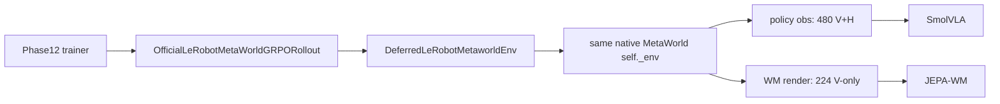

# Phase12 Strict JEPA WM Render Final Implementation Plan

> **For agentic workers:** REQUIRED SUB-SKILL: Use superpowers:subagent-driven-development (recommended) or superpowers:executing-plans to implement this plan task-by-task. Steps use checkbox (`- [ ]`) syntax for tracking.

**Goal:** Give Phase12 a strict JEPA-WM MetaWorld pixel lane: same LeRobot-backed sim state, SmolVLA policy stays on LeRobot `480x480` V+H pixels, WM/goal/decode can use native JEPA-style `224x224` V-only frames.

**Architecture:** Keep one physics env. Add a same-env WM render method inside `DeferredLeRobotMetaworldEnv`; never create a second MetaWorld env. Gate strict render behind flags, write same-state derived-vs-strict diagnostics first, then run A/B smoke before any default switch.

**Tech Stack:** Python, NumPy, PIL/imageio, Gymnasium vector envs, MetaWorld/MuJoCo renderer, LeRobot env preprocessing, PyTorch JEPA-WM.

---

## Critical Review

### Other LLM Plan

Good:
- Probe-first design is better. Same-state old/new artifacts reduce guesswork.
- Default-switch gate is right. Do not silently flip default until artifacts and A/B pass.
- Correctly flags renderer mutation contamination.
- Keeps non-goals clear: no ROI crop, no policy pixel change, no second env.

Weak:
- Says “do not change `_to_wm_visual` default in first pass,” but strict `224` still goes through current `224 -> 256 -> 224` unless resize mode is added. That misses major resize bug.
- Uses names `derived_policy_hflip` / `strict_jepa_render`; okay, but less explicit than source names tied to contracts.
- File paths are `/vol/bitbucket/...`, wrong for this workspace. Use `/rds/general/user/aa6622/home/project/...`.
- Adapter method name `render_frame_for_wm` is fine but less contract-specific than `render_jepa_frame`.
- Optional diagnostics helper should be real if we care about confidence. Make it part of plan.

### Existing Plan

Good:
- Exact renderer isolation design.
- Explicit `wm_visual_resize_mode=passthrough`, needed for true strict path.
- Routes root/goal/decode through same source.
- Tests target existing fake adapter scaffolding.

Weak:
- Too implementation-heavy before evidence. Better add probe artifacts first.
- No default-switch gate policy beyond smoke comparison.
- Static test banning direct `wm_rgb_from_policy_rgb_corner2(policy_frame)` may be brittle because helper implementation should still contain that call.
- Needs one central diagnostics helper to avoid scattering image writes.

## Final Decision

- Implement strict source as opt-in first:
  - `--wm-frame-source derived_policy_hflip` default initially.
  - `--wm-frame-source strict_jepa_render --wm-visual-resize-mode passthrough` for strict run.
- Add same-state probe artifacts before behavior routing.
- Add `render_jepa_frame(img_size=224)` inside current LeRobot adapter; no new env.
- Add `_to_wm_visual(..., resize_mode="legacy_256"|"passthrough")`.
- Do not switch default until gates pass.



---

## File Map

- Modify: `src/smolvla_grpo/lerobot_metaworld_adapter.py`
  - Add isolated `render_jepa_frame(img_size=224)`.
  - Add `OfficialLeRobotMetaWorldGRPORollout.render_jepa_frame(...)`.
- Modify: `src/segment_grpo_loop.py`
  - Add `resize_mode` to `_to_wm_visual`.
- Modify: `src/smolvla_grpo/phase12_wm_reward.py`
  - Thread `wm_visual_resize_mode` into scoring encode.
- Modify: `scripts/grpo/train_phase12_wm_chunk_grpo.py`
  - Add CLI flags, manifest fields, same-state diagnostics, WM frame routing, decode resize routing.
- Modify: `tests/test_grpo_lerobot_adapter.py`
  - Add renderer isolation and vector-call tests.
- Modify: `tests/test_segment_grpo_loop.py`
  - Add passthrough shape test.
- Modify: `tests/test_phase12_wm_reward.py`
  - Add resize-mode threading test.
- Modify: `tests/test_phase12_trainer_static.py`
  - Add CLI/manifest/static routing tests.

---

## Task 1: Add Same-State Probe Helpers

**Files:**
- Modify: `scripts/grpo/train_phase12_wm_chunk_grpo.py`
- Modify: `tests/test_phase12_trainer_static.py`

- [ ] **Step 1: Add static test for probe helper**

Append to `tests/test_phase12_trainer_static.py`:

```python
def test_phase12_has_same_state_wm_source_probe_helper() -> None:
    source = (trainer._REPO / "scripts" / "grpo" / "train_phase12_wm_chunk_grpo.py").read_text(
        encoding="utf-8"
    )

    assert "def _compare_phase12_wm_frame_sources(" in source
    assert "wm_current_derived_480.png" in source
    assert "wm_strict_render_224.png" in source
    assert "wm_source_compare.json" in source
```

- [ ] **Step 2: Run test and verify failure**

```bash
cd /rds/general/user/aa6622/home/project
pytest tests/test_phase12_trainer_static.py::test_phase12_has_same_state_wm_source_probe_helper -q
```

Expected: FAIL because helper does not exist.

- [ ] **Step 3: Add compare helper**

Add near `_write_selected_frames_png`:

```python
def _resize_uint8_rgb(frame: np.ndarray, size: tuple[int, int]) -> np.ndarray:
    from PIL import Image

    arr = np.asarray(frame, dtype=np.uint8)
    return np.asarray(Image.fromarray(arr).resize(size))


def _compare_phase12_wm_frame_sources(
    *,
    out_dir: Path,
    policy_rgb: np.ndarray,
    strict_wm_rgb: np.ndarray | None,
) -> dict[str, Any]:
    out_dir.mkdir(parents=True, exist_ok=True)
    import imageio.v2 as imageio

    derived = wm_rgb_from_policy_rgb_corner2(policy_rgb)
    result: dict[str, Any] = {
        "derived_shape": list(np.asarray(derived).shape),
        "strict_shape": None,
        "mean_abs_diff": None,
        "max_abs_diff": None,
    }

    imageio.imwrite(out_dir / "wm_current_derived_480.png", derived)

    if strict_wm_rgb is not None:
        strict = np.asarray(strict_wm_rgb, dtype=np.uint8)
        derived_resized = _resize_uint8_rgb(derived, (strict.shape[1], strict.shape[0]))
        diff = np.abs(derived_resized.astype(np.int16) - strict.astype(np.int16))
        diff_vis = np.clip(diff, 0, 255).astype(np.uint8)

        imageio.imwrite(out_dir / "wm_current_derived_resized_224.png", derived_resized)
        imageio.imwrite(out_dir / "wm_strict_render_224.png", strict)
        imageio.imwrite(out_dir / "wm_source_absdiff_224.png", diff_vis)

        result.update(
            {
                "strict_shape": list(strict.shape),
                "mean_abs_diff": float(diff.mean()),
                "max_abs_diff": float(diff.max()),
            }
        )

    (out_dir / "wm_source_compare.json").write_text(
        json.dumps(result, indent=2, sort_keys=True),
        encoding="utf-8",
    )
    return result
```

- [ ] **Step 4: Run test**

```bash
pytest tests/test_phase12_trainer_static.py::test_phase12_has_same_state_wm_source_probe_helper -q
```

Expected: PASS.

---

## Task 2: Add Isolated Same-Env JEPA Render

**Files:**
- Modify: `src/smolvla_grpo/lerobot_metaworld_adapter.py`
- Modify: `tests/test_grpo_lerobot_adapter.py`

- [ ] **Step 1: Extend fake env with mutable renderer state**

In `_install_fake_deferred_deps()`, update `FakeInner` to expose:

```python
class FakeRenderer:
    def __init__(self, width=8, height=8, camera_name="corner2"):
        self.default_cam_config = {"trackbodyid": -1}
        self.max_geom = 1000
        self.width = int(width)
        self.height = int(height)
        self.camera_name = str(camera_name)
```

Inside `FakeInner.__init__`, add:

```python
self.width = 8
self.height = 8
self.camera_name = kwargs.get("camera_name", "corner2")
self.render_mode = kwargs.get("render_mode", "rgb_array")
self.mujoco_renderer = FakeRenderer(self.width, self.height, self.camera_name)
self.render_calls: list[dict[str, object]] = []
```

Change `FakeInner.render` to:

```python
def render(self, *args, **kwargs):
    width = int(kwargs.get("width", getattr(self, "width", 8)))
    height = int(kwargs.get("height", getattr(self, "height", 8)))
    self.render_calls.append(
        {
            "width": width,
            "height": height,
            "camera_name": getattr(self, "camera_name", None),
            "renderer": self.mujoco_renderer,
        }
    )
    return np.arange(height * width * 3, dtype=np.uint8).reshape(height, width, 3)
```

Patch fake renderer:

```python
import gymnasium.envs.mujoco.mujoco_rendering as mujoco_rendering

monkeypatch.setattr(mujoco_rendering, "MujocoRenderer", FakeRenderer)
```

- [ ] **Step 2: Add failing isolation tests**

Append:

```python
def test_deferred_metaworld_render_jepa_frame_is_v_only_and_restores_policy_renderer(monkeypatch):
    _install_fake_deferred_deps(monkeypatch)
    from smolvla_grpo.lerobot_metaworld_adapter import DeferredLeRobotMetaworldEnv

    env = DeferredLeRobotMetaworldEnv(task="push-v3", camera_name="corner2")
    try:
        obs, _info = env.reset(seed=123)
        raw8 = np.arange(8 * 8 * 3, dtype=np.uint8).reshape(8, 8, 3)
        np.testing.assert_array_equal(obs["pixels"], np.flip(raw8, (0, 1)))

        inner = env._env  # noqa: SLF001
        original_renderer = inner.mujoco_renderer
        original_width = inner.width
        original_height = inner.height
        original_camera = inner.camera_name

        jepa = env.render_jepa_frame(img_size=4)
        raw4 = np.arange(4 * 4 * 3, dtype=np.uint8).reshape(4, 4, 3)

        assert jepa.shape == (4, 4, 3)
        np.testing.assert_array_equal(jepa, np.flip(raw4, 0))
        assert inner.mujoco_renderer is original_renderer
        assert inner.width == original_width
        assert inner.height == original_height
        assert inner.camera_name == original_camera
        np.testing.assert_array_equal(env.render_frame(), np.flip(raw8, (0, 1)))
    finally:
        env.close()


def test_official_rollout_exposes_jepa_frame_without_changing_policy_pixels(monkeypatch):
    _install_fake_deferred_deps(monkeypatch)
    from smolvla_grpo.lerobot_metaworld_adapter import OfficialLeRobotMetaWorldGRPORollout

    rollout = OfficialLeRobotMetaWorldGRPORollout(task="push-v3", enable_expert_oracle=True)
    try:
        obs = rollout.reset(123)
        jepa = rollout.render_jepa_frame(img_size=4)
        raw4 = np.arange(4 * 4 * 3, dtype=np.uint8).reshape(4, 4, 3)
        raw8 = np.arange(8 * 8 * 3, dtype=np.uint8).reshape(8, 8, 3)

        np.testing.assert_array_equal(jepa, np.flip(raw4, 0))
        np.testing.assert_array_equal(obs["pixels"][0], np.flip(raw8, (0, 1)))
        np.testing.assert_array_equal(rollout.render_frame(), np.flip(raw8, (0, 1)))
    finally:
        rollout.close()
```

- [ ] **Step 3: Run tests and verify failure**

```bash
pytest tests/test_grpo_lerobot_adapter.py::test_deferred_metaworld_render_jepa_frame_is_v_only_and_restores_policy_renderer tests/test_grpo_lerobot_adapter.py::test_official_rollout_exposes_jepa_frame_without_changing_policy_pixels -q
```

Expected: FAIL with `AttributeError: ... render_jepa_frame`.

- [ ] **Step 4: Add adapter helpers**

In `src/smolvla_grpo/lerobot_metaworld_adapter.py`, add module helper near `_image_debug`:

```python
def _to_rgb_uint8(frame: Any) -> np.ndarray:
    arr = np.asarray(frame)
    if arr.ndim != 3 or arr.shape[-1] not in (3, 4):
        raise ValueError(f"expected HxWx3/4 RGB frame, got {arr.shape}")
    if arr.shape[-1] == 4:
        arr = arr[..., :3]
    if arr.dtype != np.uint8:
        if np.issubdtype(arr.dtype, np.floating) and float(np.max(arr)) <= 1.5:
            arr = (np.clip(arr, 0.0, 1.0) * 255.0).astype(np.uint8)
        else:
            arr = np.clip(arr, 0, 255).astype(np.uint8)
    return np.ascontiguousarray(arr)
```

Add methods to `DeferredLeRobotMetaworldEnv`:

```python
    def _try_render_with_size(self, img_size: int) -> np.ndarray:
        assert self._env is not None
        try:
            frame = self._env.render(width=int(img_size), height=int(img_size))
        except TypeError:
            frame = self._env.render()
        return _to_rgb_uint8(frame)

    def _render_with_temporary_mujoco_renderer(self, img_size: int, old_renderer: Any) -> np.ndarray:
        assert self._env is not None
        if old_renderer is None:
            raise RuntimeError("MetaWorld env has no mujoco_renderer; cannot build isolated JEPA renderer")
        from gymnasium.envs.mujoco.mujoco_rendering import MujocoRenderer

        self._env.mujoco_renderer = MujocoRenderer(
            self._env.model,
            self._env.data,
            old_renderer.default_cam_config,
            width=int(img_size),
            height=int(img_size),
            max_geom=old_renderer.max_geom,
            camera_id=None,
            camera_name="corner2",
        )
        return _to_rgb_uint8(self._env.render())

    def _render_raw_corner2_at_size(self, img_size: int) -> np.ndarray:
        self._ensure_env()
        assert self._env is not None
        env = self._env
        size = int(img_size)
        if size <= 0:
            raise ValueError(f"img_size must be positive, got {img_size}")

        old_width = getattr(env, "width", None)
        old_height = getattr(env, "height", None)
        old_camera_name = getattr(env, "camera_name", None)
        old_renderer = getattr(env, "mujoco_renderer", None)
        try:
            env.camera_name = "corner2"
            env.width = size
            env.height = size
            raw = self._try_render_with_size(size)
            if raw.shape[:2] != (size, size):
                raw = self._render_with_temporary_mujoco_renderer(size, old_renderer)
            if raw.shape[:2] != (size, size):
                raise RuntimeError(f"JEPA render produced {raw.shape[:2]}, expected {(size, size)}")
            return raw
        finally:
            if old_camera_name is not None:
                env.camera_name = old_camera_name
            if old_width is not None:
                env.width = old_width
            if old_height is not None:
                env.height = old_height
            if old_renderer is not None:
                env.mujoco_renderer = old_renderer

    def render_jepa_frame(self, img_size: int = 224) -> np.ndarray:
        """Same-state JEPA-WM MetaWorld RGB: corner2, square size, vertical flip only."""
        raw_image = self._render_raw_corner2_at_size(int(img_size))
        return np.ascontiguousarray(np.flip(raw_image, 0))
```

Add to `OfficialLeRobotMetaWorldGRPORollout`:

```python
    def render_jepa_frame(self, img_size: int = 224, env_index: int = 0) -> np.ndarray:
        frames = self.vec_env.call("render_jepa_frame", int(img_size))
        return np.asarray(frames[int(env_index)])
```

- [ ] **Step 5: Run adapter tests**

```bash
pytest tests/test_grpo_lerobot_adapter.py -q
```

Expected: PASS.

---

## Task 3: Add WM Visual Passthrough Mode

**Files:**
- Modify: `src/segment_grpo_loop.py`
- Modify: `tests/test_segment_grpo_loop.py`

- [ ] **Step 1: Add failing test**

Append near `test_to_wm_visual_feeds_jepa_hub_encode_range`:

```python
def test_to_wm_visual_passthrough_keeps_input_resolution_for_jepa_preprocessor() -> None:
    torch = pytest.importorskip("torch")
    image = np.full((24, 32, 3), 255, dtype=np.uint8)

    t = _to_wm_visual(image, torch.device("cpu"), resize_mode="passthrough")

    assert t.shape == (1, 1, 3, 24, 32)
    assert float(t.max()) > 200.0
    assert float(t.min()) >= 0.0
```

- [ ] **Step 2: Run test and verify failure**

```bash
pytest tests/test_segment_grpo_loop.py::test_to_wm_visual_passthrough_keeps_input_resolution_for_jepa_preprocessor -q
```

Expected: FAIL with unexpected keyword.

- [ ] **Step 3: Implement `resize_mode`**

Change `_to_wm_visual`:

```python
def _to_wm_visual(image: Any, device: torch.device, *, resize_mode: str = "legacy_256") -> torch.Tensor:
    _require_torch("WM visual conversion requires torch.")
    rgb = _to_rgb_uint8(image)
    if not rgb.flags.writeable:
        rgb = rgb.copy()
    tensor = torch.from_numpy(rgb).float()
    tensor = tensor.permute(2, 0, 1).unsqueeze(0)
    mode = str(resize_mode)
    if mode == "legacy_256":
        tensor = torch.nn.functional.interpolate(
            tensor, size=(256, 256), mode="bilinear", align_corners=False
        )
    elif mode == "passthrough":
        pass
    else:
        raise ValueError(f"Unknown WM visual resize mode: {resize_mode}")
    return tensor.unsqueeze(0).to(device)
```

- [ ] **Step 4: Run targeted tests**

```bash
pytest tests/test_segment_grpo_loop.py::test_to_wm_visual_feeds_jepa_hub_encode_range tests/test_segment_grpo_loop.py::test_to_wm_visual_passthrough_keeps_input_resolution_for_jepa_preprocessor -q
```

Expected: PASS.

---

## Task 4: Thread Resize Mode Through WM Encode

**Files:**
- Modify: `src/smolvla_grpo/phase12_wm_reward.py`
- Modify: `tests/test_phase12_wm_reward.py`

- [ ] **Step 1: Add failing test**

Append:

```python
def test_score_phase12_chunk_threads_wm_visual_resize_mode() -> None:
    class ShapeRecordingWM(FakeWM):
        class Model:
            action_dim = 4

            def __init__(self) -> None:
                self.visual_shape = None

            def encode(self, obs):
                self.visual_shape = tuple(obs["visual"].shape)
                return {"visual": torch.zeros(1, 1, 1), "proprio": obs["proprio"]}

            def unroll(self, z, *, act_suffix, debug=False):
                del act_suffix, debug
                return z

        model = Model()

    wm = ShapeRecordingWM()
    score_phase12_chunk_with_wm(
        wm_bundle=wm,
        image=np.zeros((24, 32, 3), dtype=np.uint8),
        proprio=np.zeros(2, dtype=np.float32),
        chunk_actions=np.zeros((1, 4), dtype=np.float32),
        goal={"visual": torch.zeros(1, 1, 1), "proprio": torch.zeros(1, 1, 2)},
        candidate_index=0,
        proprio_alpha=0.1,
        mode="visual_proprio",
        wm_visual_resize_mode="passthrough",
    )

    assert wm.model.visual_shape == (1, 1, 3, 24, 32)
```

- [ ] **Step 2: Run test and verify failure**

```bash
pytest tests/test_phase12_wm_reward.py::test_score_phase12_chunk_threads_wm_visual_resize_mode -q
```

Expected: FAIL with unexpected keyword.

- [ ] **Step 3: Update `_encode_structured`**

```python
def _encode_structured(
    wm_bundle: Any,
    image: np.ndarray,
    proprio: np.ndarray,
    *,
    mode: str,
    wm_visual_resize_mode: str = "legacy_256",
) -> dict[str, torch.Tensor]:
    obs = {
        "visual": _to_wm_visual(image, wm_bundle.device, resize_mode=wm_visual_resize_mode),
        "proprio": _to_wm_proprio(proprio, int(wm_bundle.proprio_dim), wm_bundle.device),
    }
```

- [ ] **Step 4: Update `score_phase12_chunk_with_wm`**

Add kwarg:

```python
    wm_visual_resize_mode: str = "legacy_256",
```

Call:

```python
    start = _encode_structured(
        wm_bundle,
        image,
        proprio,
        mode=mode,
        wm_visual_resize_mode=wm_visual_resize_mode,
    )
```

- [ ] **Step 5: Run tests**

```bash
pytest tests/test_phase12_wm_reward.py -q
```

Expected: PASS.

---

## Task 5: Add Frame Source Flags And Routing

**Files:**
- Modify: `scripts/grpo/train_phase12_wm_chunk_grpo.py`
- Modify: `tests/test_phase12_trainer_static.py`

- [ ] **Step 1: Add CLI/manifest tests**

In `test_phase12_cli_defaults`, add:

```python
    assert args.wm_frame_source == "derived_policy_hflip"
    assert args.wm_render_img_size == 224
    assert args.wm_visual_resize_mode == "legacy_256"
```

Append:

```python
def test_manifest_records_strict_jepa_wm_source(tmp_path) -> None:
    args = parse_args(
        [
            "--output-dir",
            str(tmp_path),
            "--dry-run",
            "--wm-frame-source",
            "strict_jepa_render",
            "--wm-visual-resize-mode",
            "passthrough",
        ]
    )

    manifest = build_manifest(args)

    assert manifest["phase12_policy_frame_contract"] == "lerobot_corner2_vhflip"
    assert manifest["phase12_wm_frame_source"] == "strict_jepa_render"
    assert manifest["phase12_wm_frame_contract"] == "jepa_metaworld_corner2_vflip_224"
    assert manifest["phase12_goal_frame_contract"] == "jepa_metaworld_corner2_vflip_224"
    assert manifest["wm_visual_resize_mode"] == "passthrough"
```

- [ ] **Step 2: Add parser args**

Add after `--save-wm-decodes`:

```python
    p.add_argument(
        "--wm-frame-source",
        choices=("derived_policy_hflip", "strict_jepa_render"),
        default=os.environ.get("PHASE12_WM_FRAME_SOURCE", "derived_policy_hflip"),
    )
    p.add_argument(
        "--wm-render-img-size",
        type=int,
        default=int(os.environ.get("PHASE12_WM_RENDER_IMG_SIZE", "224")),
    )
    p.add_argument(
        "--wm-visual-resize-mode",
        choices=("legacy_256", "passthrough"),
        default=os.environ.get("PHASE12_WM_VISUAL_RESIZE_MODE", "legacy_256"),
    )
```

- [ ] **Step 3: Update manifest**

Add fields:

```python
        "phase12_policy_frame_contract": "lerobot_corner2_vhflip",
        "phase12_wm_frame_source": str(args.wm_frame_source),
        "phase12_wm_frame_contract": (
            "jepa_metaworld_corner2_vflip_224"
            if str(args.wm_frame_source) == "strict_jepa_render"
            else "jepa_corner2_vflip_from_lerobot_policy_hflip"
        ),
        "phase12_goal_frame_contract": (
            "jepa_metaworld_corner2_vflip_224"
            if str(args.wm_frame_source) == "strict_jepa_render"
            else "jepa_corner2_vflip_from_lerobot_policy_hflip"
        ),
        "phase12_decode_real_frame_source": "wm_frames",
        "wm_render_img_size": int(args.wm_render_img_size),
        "wm_visual_resize_mode": str(args.wm_visual_resize_mode),
```

- [ ] **Step 4: Add frame-source helper**

Add near probe helper:

```python
def _phase12_wm_frame_from_env(
    *,
    env_h: Any,
    policy_frame: np.ndarray,
    wm_frame_source: str,
    wm_render_img_size: int,
) -> np.ndarray:
    if str(wm_frame_source) == "derived_policy_hflip":
        return wm_rgb_from_policy_rgb_corner2(policy_frame)
    if str(wm_frame_source) == "strict_jepa_render":
        return np.asarray(env_h.render_jepa_frame(int(wm_render_img_size)), dtype=np.uint8)
    raise ValueError(f"Unknown WM frame source: {wm_frame_source}")
```

- [ ] **Step 5: Route selected rollout**

Add args to `_Phase12OfficialRolloutAdapter.__init__`:

```python
        wm_frame_source: str,
        wm_render_img_size: int,
```

Store:

```python
        self.wm_frame_source = str(wm_frame_source)
        self.wm_render_img_size = int(wm_render_img_size)
```

Replace root/step `_wm_frame` assignments with:

```python
        self._wm_frame = _phase12_wm_frame_from_env(
            env_h=self.env_h,
            policy_frame=self._frame,
            wm_frame_source=self.wm_frame_source,
            wm_render_img_size=self.wm_render_img_size,
        )
```

Pass constructor args:

```python
            wm_frame_source=args.wm_frame_source,
            wm_render_img_size=int(args.wm_render_img_size),
```

- [ ] **Step 6: Route oracle frames**

Add parameters to oracle baseline collector:

```python
    wm_frame_source: str,
    wm_render_img_size: int,
```

Replace oracle reset/step `wm_frames` writes with `_phase12_wm_frame_from_env(...)`.

Pass args into oracle call:

```python
            wm_frame_source=args.wm_frame_source,
            wm_render_img_size=int(args.wm_render_img_size),
```

- [ ] **Step 7: Thread resize mode into score and decode**

In `score_phase12_chunk_with_wm(...)` call:

```python
                wm_visual_resize_mode=args.wm_visual_resize_mode,
```

In `_decode_phase12_prediction_frames`, add kwarg:

```python
    wm_visual_resize_mode: str = "legacy_256",
```

Change decode encode:

```python
        "visual": _to_wm_visual(image, wm_bundle.device, resize_mode=wm_visual_resize_mode),
```

Pass from caller:

```python
            wm_visual_resize_mode=args.wm_visual_resize_mode,
```

- [ ] **Step 8: Run tests**

```bash
pytest tests/test_phase12_trainer_static.py tests/test_phase12_wm_reward.py -q
```

Expected: PASS.

---

## Task 6: Write Pixel Contract And Source Diff Artifacts

**Files:**
- Modify: `scripts/grpo/train_phase12_wm_chunk_grpo.py`

- [ ] **Step 1: Add contract writer**

Add:

```python
def _write_phase12_pixel_contract_debug(
    *,
    out_dir: Path,
    policy_frame: np.ndarray,
    wm_frame: np.ndarray,
    wm_frame_source: str,
    wm_visual_resize_mode: str,
) -> None:
    out_dir.mkdir(parents=True, exist_ok=True)
    import imageio.v2 as imageio

    policy = np.asarray(policy_frame, dtype=np.uint8)
    wm = np.asarray(wm_frame, dtype=np.uint8)
    imageio.imwrite(out_dir / "policy_frame0.png", policy)
    imageio.imwrite(out_dir / "wm_frame0.png", wm)
    (out_dir / "pixel_contract.json").write_text(
        json.dumps(
            {
                "policy_frame_shape": list(policy.shape),
                "wm_frame_shape": list(wm.shape),
                "wm_frame_source": str(wm_frame_source),
                "wm_visual_resize_mode": str(wm_visual_resize_mode),
                "policy_contract": "lerobot_corner2_vhflip",
                "wm_contract": (
                    "jepa_metaworld_corner2_vflip_224"
                    if str(wm_frame_source) == "strict_jepa_render"
                    else "jepa_corner2_vflip_from_lerobot_policy_hflip"
                ),
            },
            indent=2,
            sort_keys=True,
        ),
        encoding="utf-8",
    )
```

- [ ] **Step 2: Call diagnostics after rollout adapter init**

After `_Phase12OfficialRolloutAdapter(...)` construction:

```python
        strict_probe = None
        try:
            strict_probe = np.asarray(env_h.render_jepa_frame(int(args.wm_render_img_size)), dtype=np.uint8)
        except Exception as exc:
            strict_probe = None
            meta_probe_error = str(exc)
        else:
            meta_probe_error = None

        source_compare = _compare_phase12_wm_frame_sources(
            out_dir=episode_dir / "wm_source_probe",
            policy_rgb=rollout_env.frames[0],
            strict_wm_rgb=strict_probe,
        )
        if meta_probe_error is not None:
            source_compare["strict_probe_error"] = meta_probe_error
            (episode_dir / "wm_source_probe" / "wm_source_compare.json").write_text(
                json.dumps(source_compare, indent=2, sort_keys=True),
                encoding="utf-8",
            )

        _write_phase12_pixel_contract_debug(
            out_dir=episode_dir / "pixel_contract",
            policy_frame=rollout_env.frames[0],
            wm_frame=rollout_env.wm_frames[0],
            wm_frame_source=args.wm_frame_source,
            wm_visual_resize_mode=args.wm_visual_resize_mode,
        )
```

- [ ] **Step 3: Run static tests**

```bash
pytest tests/test_phase12_trainer_static.py -q
```

Expected: PASS.

---

## Task 7: Run A/B Smoke Gate

**Files:**
- No source edits unless smoke exposes bug.

- [ ] **Step 1: Run derived control**

```bash
cd /rds/general/user/aa6622/home/project
module load tools/prod Python/3.12.3-GCCcore-13.3.0
"/rds/general/user/aa6622/home/.envs/lerobot_mw_py312/bin/python" scripts/grpo/train_phase12_wm_chunk_grpo.py \
  --mode rollout_validation \
  --jepa-repo /rds/general/user/aa6622/home/research/RESEARCH_PAPER_CLONES/jepa-wms \
  --jepa-ckpt /rds/general/user/aa6622/home/.cache/huggingface/hub/models--facebook--jepa-wms/snapshots/9b9c41ef249466630dbf1a20e78391865d07b3b9/jepa_wm_metaworld.pth.tar \
  --output-dir artifacts/phase12_wm_render_ab/derived_policy_hflip \
  --task push-v3 \
  --num-episodes 1 \
  --num-updates 1 \
  --max-steps 50 \
  --chunk-len 25 \
  --group-size 4 \
  --wm-frame-source derived_policy_hflip \
  --wm-visual-resize-mode legacy_256 \
  --decode-candidates selected
```

Expected:
- Exit `0`.
- `pixel_contract.json` reports WM frame `[480, 480, 3]`.
- `wm_source_probe/wm_source_compare.json` exists.

- [ ] **Step 2: Run strict JEPA**

```bash
cd /rds/general/user/aa6622/home/project
module load tools/prod Python/3.12.3-GCCcore-13.3.0
"/rds/general/user/aa6622/home/.envs/lerobot_mw_py312/bin/python" scripts/grpo/train_phase12_wm_chunk_grpo.py \
  --mode rollout_validation \
  --jepa-repo /rds/general/user/aa6622/home/research/RESEARCH_PAPER_CLONES/jepa-wms \
  --jepa-ckpt /rds/general/user/aa6622/home/.cache/huggingface/hub/models--facebook--jepa-wms/snapshots/9b9c41ef249466630dbf1a20e78391865d07b3b9/jepa_wm_metaworld.pth.tar \
  --output-dir artifacts/phase12_wm_render_ab/strict_jepa_render \
  --task push-v3 \
  --num-episodes 1 \
  --num-updates 1 \
  --max-steps 50 \
  --chunk-len 25 \
  --group-size 4 \
  --wm-frame-source strict_jepa_render \
  --wm-visual-resize-mode passthrough \
  --decode-candidates selected
```

Expected:
- Exit `0`.
- `pixel_contract.json` reports WM frame `[224, 224, 3]`.
- Decode strip exists.
- Policy video/obs still use LeRobot shape.

- [ ] **Step 3: Compare smoke outputs**

```bash
"/rds/general/user/aa6622/home/.envs/lerobot_mw_py312/bin/python" - <<'PY'
import json
from pathlib import Path

for name in ["derived_policy_hflip", "strict_jepa_render"]:
    root = Path("artifacts/phase12_wm_render_ab") / name
    manifest = json.loads((root / "smoke_manifest.json").read_text())
    contract = json.loads(next(root.glob("rollouts/update_0000_episode_0000/pixel_contract/pixel_contract.json")).read_text())
    probe = json.loads(next(root.glob("rollouts/update_0000_episode_0000/wm_source_probe/wm_source_compare.json")).read_text())
    strip = next(root.glob("rollouts/update_0000_episode_0000/segment_0000/wm_real_vs_pred_selected_strip.png"))
    print(name)
    print("  frame_source:", manifest.get("phase12_wm_frame_source"))
    print("  resize_mode:", manifest.get("wm_visual_resize_mode"))
    print("  wm_shape:", contract.get("wm_frame_shape"))
    print("  source_diff_mean:", probe.get("mean_abs_diff"))
    print("  strip:", strip)
PY
```

Expected:
- Derived: `derived_policy_hflip`, `legacy_256`, `[480, 480, 3]`.
- Strict: `strict_jepa_render`, `passthrough`, `[224, 224, 3]`.

---

## Task 8: Default Switch Only After Gate

**Gate:**
- Adapter tests prove policy pixels unchanged after JEPA render.
- Strict WM frame is `[224,224,3]`.
- A/B smoke exits cleanly.
- Decode artifacts exist for both runs.
- Strict run no worse by human visual check or selected score distribution.

- [ ] **Step 1: If gate passes, change default**

Only then change parser default:

```python
default=os.environ.get("PHASE12_WM_FRAME_SOURCE", "strict_jepa_render")
```

Set paired default:

```python
default=os.environ.get("PHASE12_WM_VISUAL_RESIZE_MODE", "passthrough")
```

Keep rollback:

```bash
--wm-frame-source derived_policy_hflip --wm-visual-resize-mode legacy_256
```

- [ ] **Step 2: Run final focused suite**

```bash
pytest \
  tests/test_phase12_pixels.py \
  tests/test_grpo_lerobot_adapter.py \
  tests/test_segment_grpo_loop.py::test_to_wm_visual_feeds_jepa_hub_encode_range \
  tests/test_segment_grpo_loop.py::test_to_wm_visual_passthrough_keeps_input_resolution_for_jepa_preprocessor \
  tests/test_phase12_wm_reward.py \
  tests/test_phase12_trainer_static.py -q
```

Expected: PASS.

---

## Non-Goals

- No ROI crop.
- No second MetaWorld physics env.
- No SmolVLA policy pixel change.
- No action/reward/GRPO math change.
- No default switch before evidence gate.
- No commit unless user explicitly requests.

## Self-Review

- Spec coverage: same-env strict JEPA render, LeRobot preserved, renderer isolation, timing, probe-first evidence, resize-path fix, source routing, diagnostics, A/B gate.
- Placeholder scan: no TBD/TODO/“similar to”.
- Type consistency: source names `derived_policy_hflip` and `strict_jepa_render` used across CLI, manifest, routing, diagnostics, and smoke.
- Main risk left: MetaWorld renderer API version variance. Mitigated with `render(width,height)` attempt + temporary `MujocoRenderer` fallback + `finally` restore.
